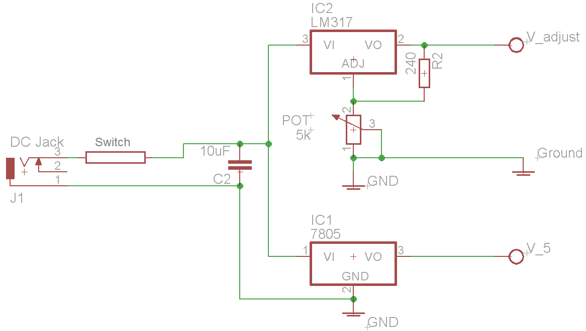
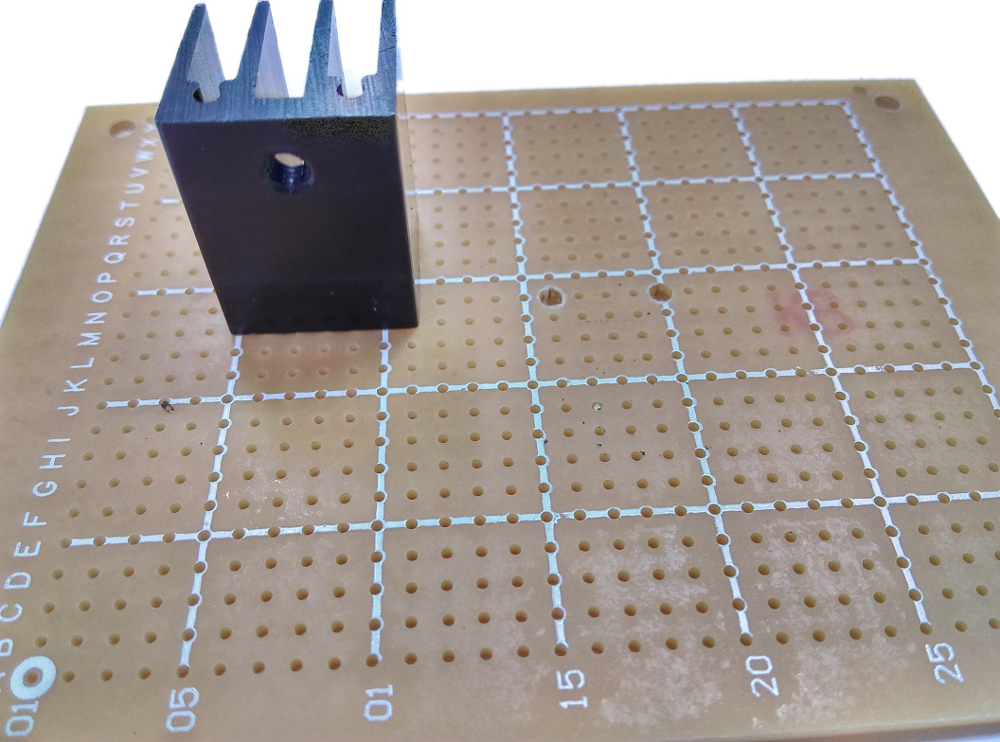
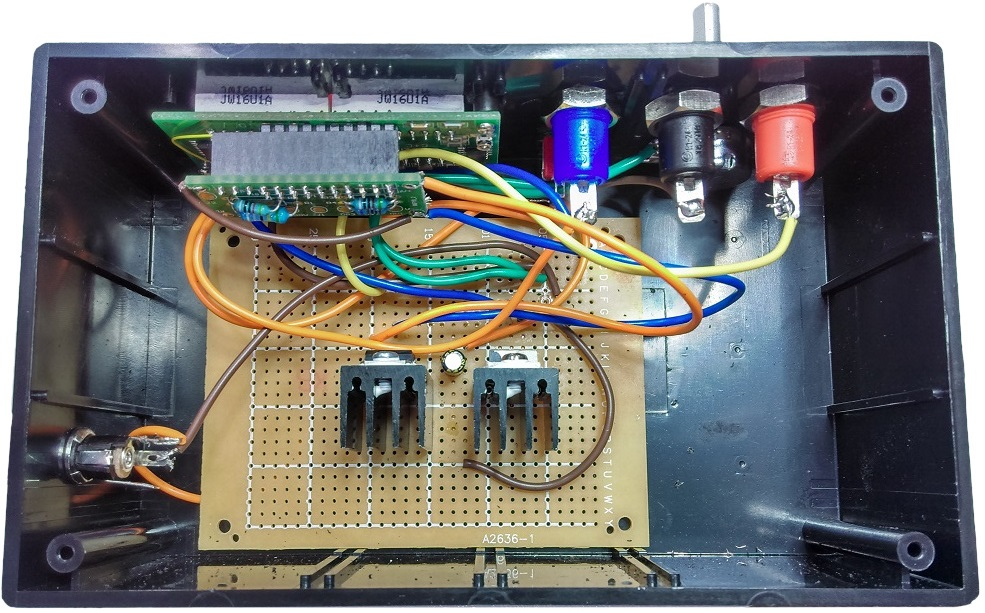

# Benchtop Power Supply
What better way to get back in to work with your own personal benchtop power supply.  Uses a LM317 for power output and provides a separate 5V rail.

You will need a power supply higher than 7V to power this unit, and it will only be able to power up to 2V less than the power you give it.

###### Example
* If you want to have an adjustable 2-28V supply, you will have to use a 30V power supply.
* If you give it a 17V power supply, it will be adjustable between 2V and 15V.

# Bill of Materials
|Qty| Code | Description |
|---|---|---|
|1 | [HB6011](http://jaycar.com.au/p/HB6011) | Jiffy Box enclosure
|1 | [ZV1615](http://jaycar.com.au/p/ZV1615) | 2-30V adjustable voltage regulator
|1 | [ZV1505](http://jaycar.com.au/p/ZV1505) | 5V+ voltage regulator
|2 | [HH8516](http://jaycar.com.au/p/HH8516) | TO220 Heatsink
|1 | [HP9550](http://jaycar.com.au/p/HP9550) | experimenters PCB
|1 | [NM2010](http://jaycar.com.au/p/NM2010) | Heatsink Compound
|1 | [QP5580](http://jaycar.com.au/p/QP5580) | LED Voltage Panel Meter
|1 | [ST0335](http://jaycar.com.au/p/ST0335) | Mini toggle switch
|1 | [QP5575](http://jaycar.com.au/p/QP5575) | Panel Meter addon board
|1 | [RP7508](http://jaycar.com.au/p/RP7508) | 5k potentiometer
|1 | [RR0557](http://jaycar.com.au/p/RR0557) | 240 ohm resistor
|1 | [RE6070](http://jaycar.com.au/p/RE6070) | 10uF capacitor

* In this project we have allowed you to select your own power sockets and knob for the adjust. You could use the same [PS042X](https://jaycar.com.au/p/PS0421) series that we have, or use something like the [PT045X](https://jaycar.com.au/p/PT0454) series. The choice is really up to you.

* You will also need some wires to connect different components together, if you don't have it already, the [WH3009 8 Colour pack](http://jaycar.com.au/p/WH3009) is a good choice to have in your workshop.

* [WT5320 Banana lead to Alligator clips](http://jaycar.com.au/p/WT5320) is a great addition for this project as you can start using it right away once you've finished.

* Good Power supply design includes fuses ([SF2160](http://jaycar.com.au/p/SF2160)) and fuse holders ([SZ2028](http://jaycar.com.au/p/SZ2028)), however this is simply more as a guide to get your feet wet; If you want to include fuses, wire them inline right between the switch and DC socket.

# Connections

The basic connections are as above. You're simply setting up two regulators from the same power supply, and having a common ground connection going through to the front panel. The QP panel meter will measure the voltage on the LM317 so that you have feedback on what voltage you're providing.

We've tried to make a fritizing diagram to make the idea easier to transfer to the PCB board.

Some notes:

* Teal connection (Vin)goes through a switch to the DC power socket.

* Black connection is ground, also from DC power socket, to the front Panel

* Left `V-REG` is the `7805` 5V regulator, Right `V-REG` is the `LM317`.

* Potentiometer fits between pin 1 of the `LM317` and ground.

* Pin 2 of `LM317` is the output, compared to pin 3 for the `7805`

* the 240R resistor fits between pins 1 and 2 of the `LM317`

# Assembly

For building the actual unit, it's easier to put in the heatsinks first, by drilling out some small 2-3mm holes to fit in the legs of the heatsinks.

Then place in the regulators.

## Case

*We have provided a cutout file for both of our projects this month, so feel free to print out (or, if you're very nice, you can ask the store to print out for you) a cutout sheet, and use some cheap glue to keep the paper in place while you drill and cut into the Jiffy enclosures. This will help get the sizes just right.*

[Cutouts.pdf](cutouts.pdf)

While we haven't used it, we've heard post-humorously that the [TH1768](https://jaycar.com.au/p/TH1768) is great for this, and we'll be trying it next time we're modifying a Jiffy box.

Once it on, try drilling some of it out, or use a band-saw or similar to carefully cut around the outline of the display.

You can then place and drill out the remaining components, which are all circular.

| Component | Size |
| --- | --- |
| DC Jack  | 10mm|
| 3x Banana sockets | the PS042X series is 10mm |
| Potentiometer | 10mm |
| Power Switch | 5mm |

As you could already see, ours turned out like this, with a DC jack coming from the side:

When connecting up the circuit board, make sure no part of the circuit is touching any other part it shouldn't; shorting these components have the potential to cause a bit of a bang.

Once the minimal circuit is connected up, Test the voltages you get from the regulators before you continue on placing everything in, as it will be easier to fix problems now, rather than later.

Once the regulators are regulating, you can then attach wires from the outputs to the QP addon board as shown:

You also need to bridge solder over the `20V` and the `DP2` pads. this is so the module knows what it is displaying and we know what it's reading. We've made little MS-paint solder so you can see.

Then, finally, connect the DC socket, Switch, Banana sockets, Panel Meter and potentiometer. Here's a block diagram to help you figure out how it all comes together

Unfortunately we didn't have much planning before we built this, so our final result ended up being a bit of a mess,

## Use

Simply flick the unit on, adjust it to the voltage required, and plug in your banana leads. If you want attach a knob, simply cut down the size of the potentiometer.
